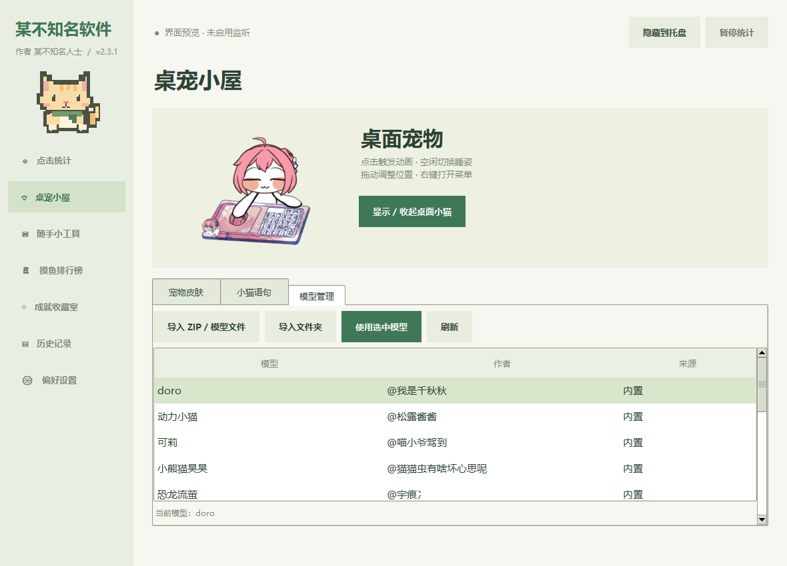

# 猫薄荷

Windows 桌面点击统计与小猫桌宠。支持本机每日记录、历史排行、便签、提醒，以及原版像素猫、Bongo Cat 和社区模型。界面与使用说明均为中文。



## 版本与目录

- 根目录：完整版源码，支持导入 Live2D Cubism 3 模型。
- `lite/`：轻量版源码，使用预渲染帧，不支持导入新模型。
- `assets/`、`lite/assets/`：运行所需素材。完整版的社区模型和 OpenGL 运行库因体积较大，随发布页中的 `猫薄荷-运行素材-v2.3.3.zip` 单独提供；解压到仓库根目录后即可从源码构建。来源及授权见[素材来源](素材来源.md)和[第三方组件说明](第三方组件说明.md)。
- [使用说明](使用说明.md)：功能、操作和数据存储说明。

当前构建版本为 **v2.3.3**。两种 Windows 安装包、完整运行素材和 SHA-256 校验值见[GitHub Releases](https://github.com/Xiaochenzix/maobohe/releases/tag/v2.3.3)；更新内容见[发布说明](发布说明-v2.3.3.md)。旧安装包和本机运行数据不在仓库中。

## 运行源码

需要 Windows 10/11、Python 3.12（含 Tkinter）和对应依赖。建议在虚拟环境中运行：

```powershell
py -3.12 -m venv .venv
.\.venv\Scripts\python.exe -m pip install -r requirements.txt
.\.venv\Scripts\python.exe app.py
```

轻量版可只安装 `requirements-lite.txt`，然后运行 `python lite/app.py`。默认启动到系统托盘并显示桌宠；从托盘打开主界面。测试界面可运行 `python app.py --preview`。

## 构建

先将发布页的 `猫薄荷-运行素材-v2.3.3.zip` 解压到仓库根目录，再安装 PyInstaller 并运行：

```powershell
python -m pip install pyinstaller
python -m PyInstaller "猫薄荷.spec"
python -m PyInstaller "猫薄荷-轻量版.spec"
```

打包结果位于 `dist/`。完整版依赖的 Live2D、OpenGL 和社区素材有各自的许可；分发前请阅读上述来源与组件说明。

## 小猫主动互动

小猫会偶尔挥爪招呼，招呼期间单击它会得到回应。暂停统计时不会主动招呼；右键菜单可关闭或开启“主动互动”。
